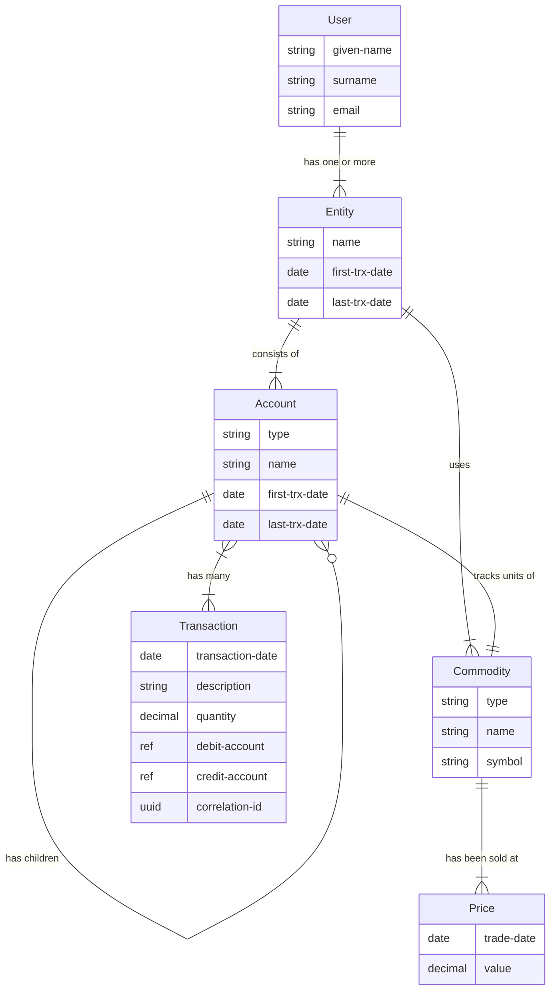

# xtdb-money
[](https://github.com/dgknght/xtdb-money/actions/workflows/clojure.yml)

Double-entry accounting application with multiple backend storage options

# ERD


# Local Development

## Stylesheet
Build the stylesheets with [Dart Sass](https://sass-lang.com/dart-sass/)

### Installation
```bash
npm install -g sass
```

### Build
```bash
sass src/scss/site.scss resources/public/css/site.css
```

Copyright © 2023

This program and the accompanying materials are made available under the
terms of the Eclipse Public License 2.0 which is available at
http://www.eclipse.org/legal/epl-2.0.

This Source Code may also be made available under the following Secondary
Licenses when the conditions for such availability set forth in the Eclipse
Public License, v. 2.0 are satisfied: GNU General Public License as published by
the Free Software Foundation, either version 2 of the License, or (at your
option) any later version, with the GNU Classpath Exception which is available
at https://www.gnu.org/software/classpath/license.html.
